Hi there! 👋 I'm a FullStack JavaScript Software Engineer, specialized in NodeJS, based in Tbilisi, Georgia, dedicated to helping businesses build scalable, efficient, and well-architected solutions.

✅ **Specialized NodeJS development** combined with broad, full-stack software expertise 
✅ **System scaling** to ensure your application handles growth and high traffic reliably 
✅ **Architectural optimization** to identify and resolve complex system bottlenecks 
✅ **Efficient AI integration** to accelerate development and enhance your product's capabilities

---

Most of my works are proprietary but...

### 💼 You can take a look on my featured portfolio items

<strong>📱 Multi212 Android App</strong>

 

**Role:** Lead Engineer  
**Tech Stack:** React Native | Expo | JavaScript  

Built a lightweight ERP-Lite Android app for managing commerce, logistics, and inventory on the go. The mobile workspace helps importers and dealers handle products, sales, purchases, and stock movements across multiple warehouses—without the overhead of a full enterprise ERP. Tailored for both solopreneurs and teams. Source code is available on [Codeberg](https://codeberg.org/rostomi/multi212); pre-built APKs can be downloaded from the [Releases](https://codeberg.org/rostomi/multi212/releases) page.

  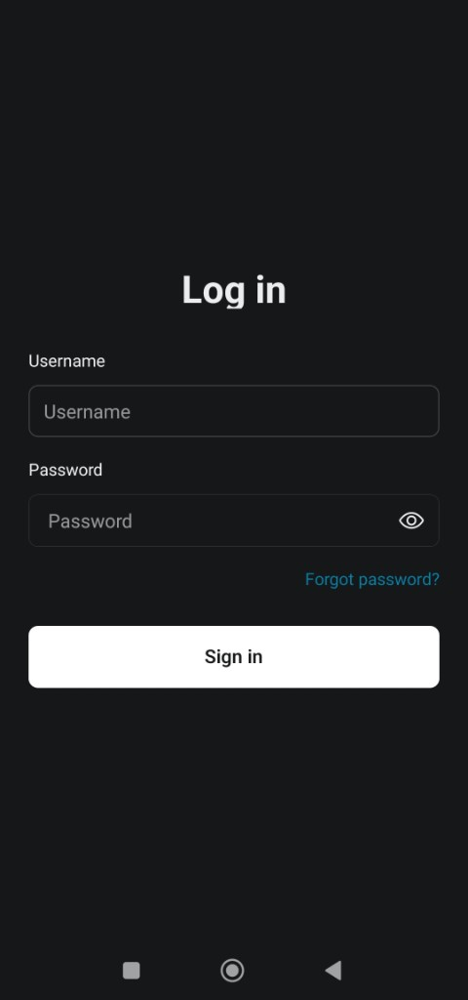
  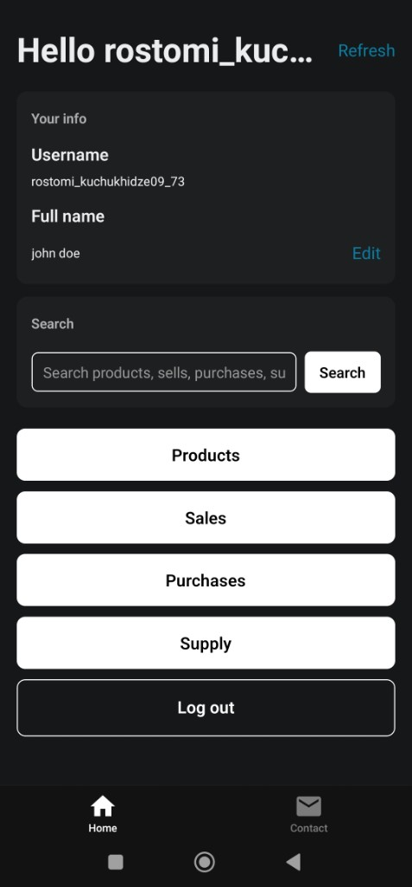
  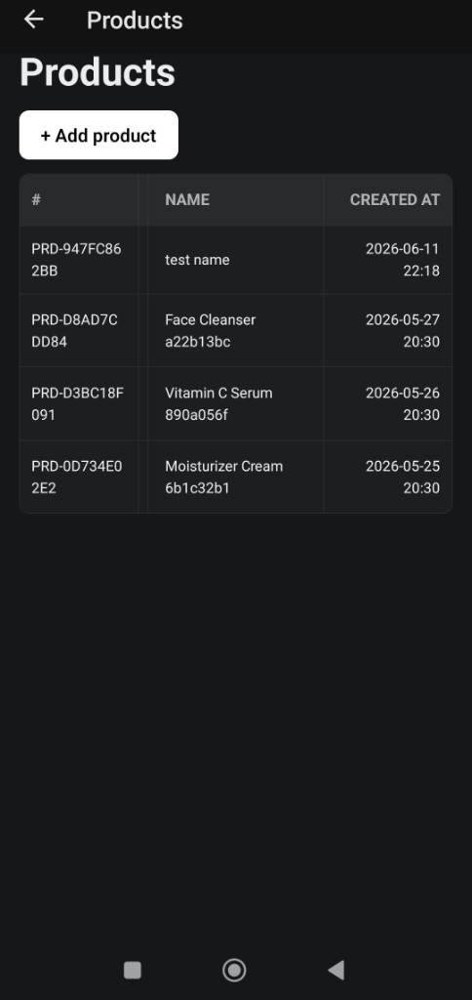
  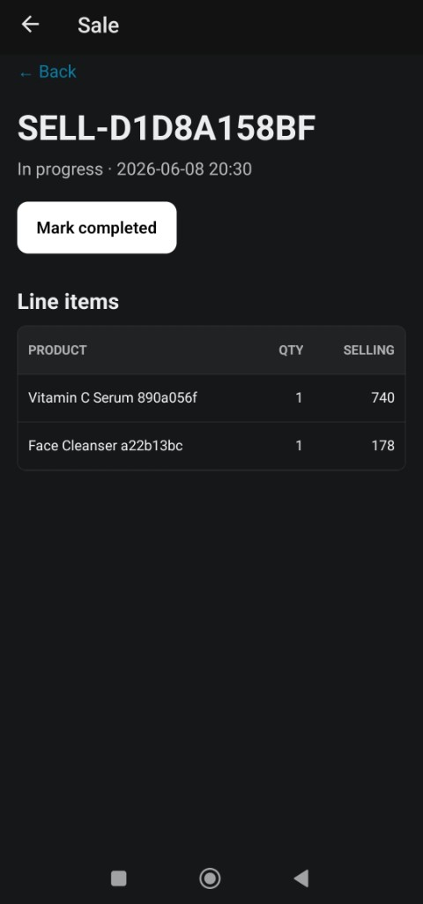

  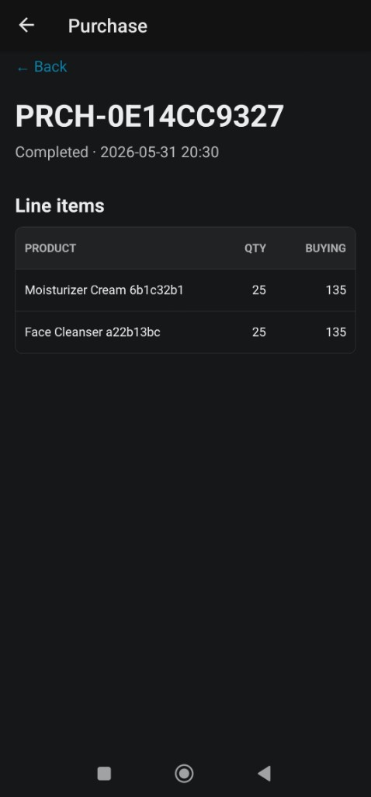
  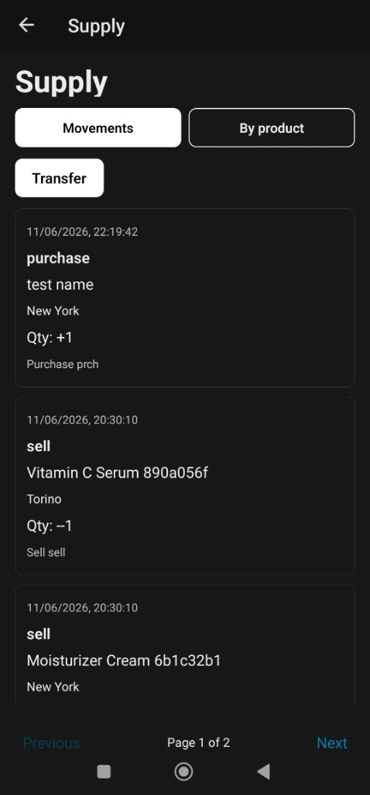
  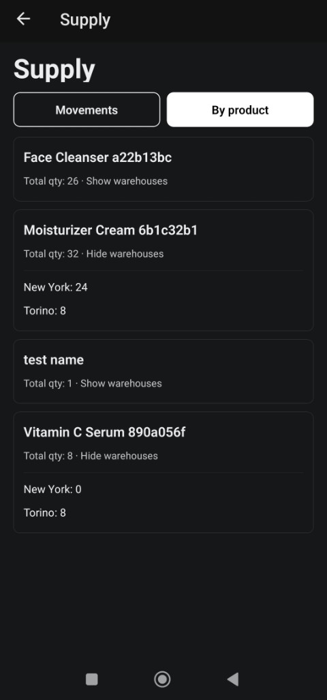
  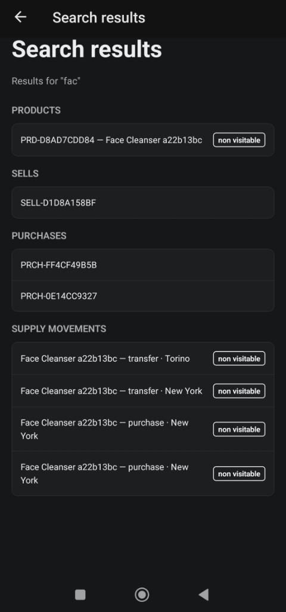

<strong>📊 Multi212.app ERP-Lite console</strong>

 

**Role:** Lead Engineer  
**Tech Stack:** Fastify | Amazon Lightsail | Amazon Cognito | Docker Compose | Next.js | Hasura  

Built an ERP-Lite inventory, commerce, and logistics tracking dashboard that helps importers and dealers measure supply, expenses, income, profits, and goods transportation. The platform is tailored for both solopreneurs and teams. You can check it out at [Github Repo](https://github.com/rosjerry/multi212) or [multi212.app](https://multi212.app).

  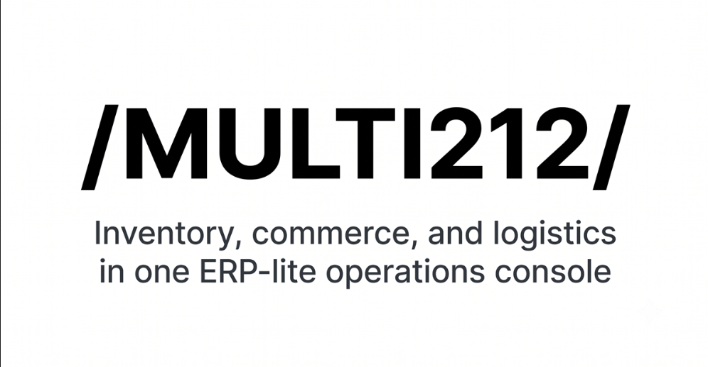
  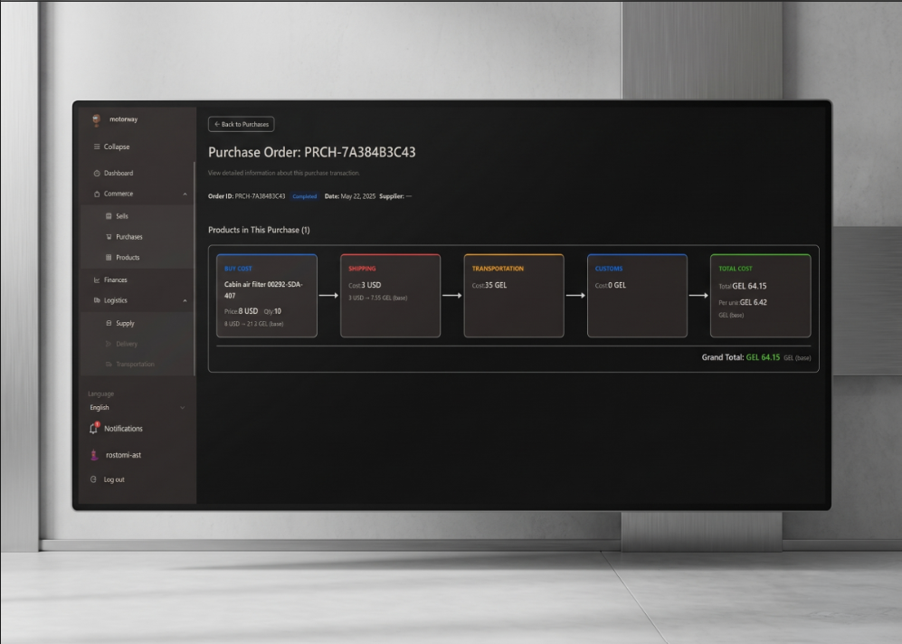
  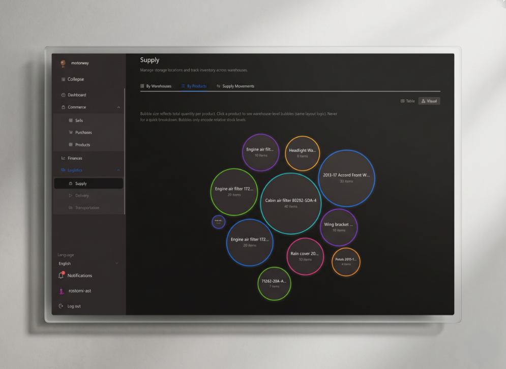

  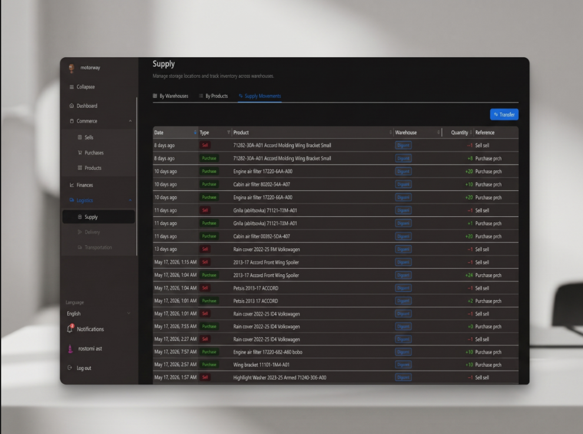
  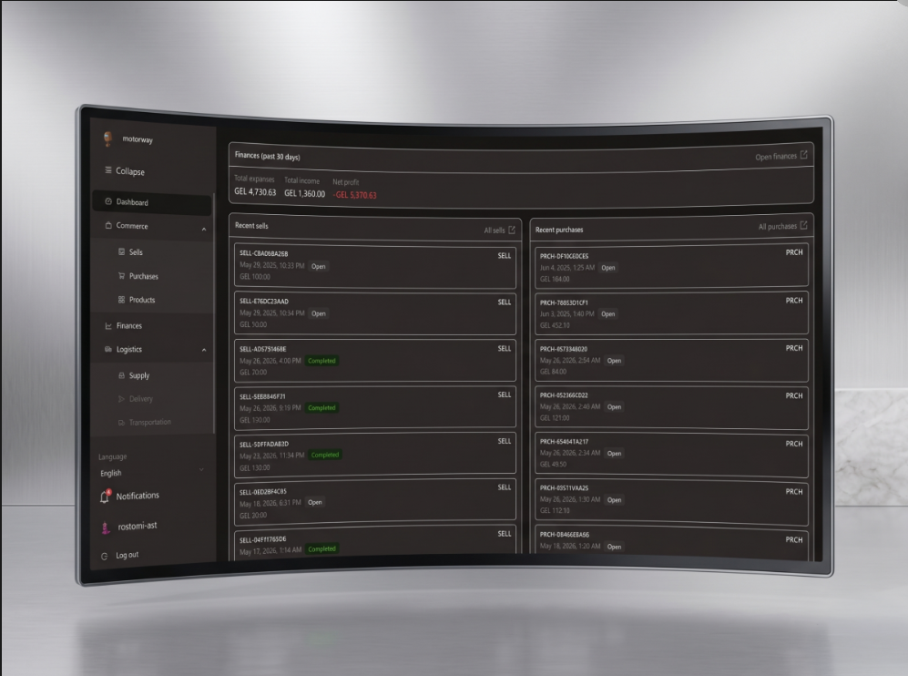
  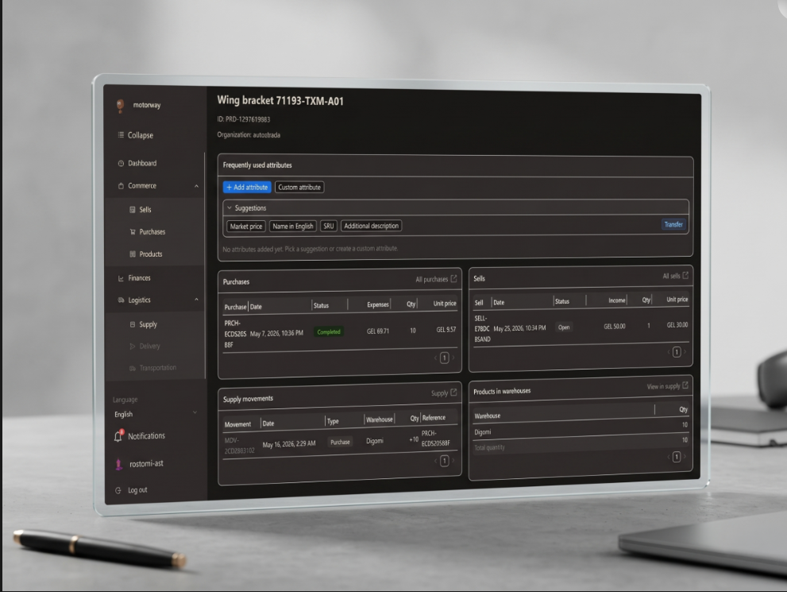

<strong>🚛 OMOFOX Transportation Dashboard</strong>

 

**Role:** Back-End Engineer  
**Tech Stack:** Node.js | ExpressJS | GraphQL | PostgreSQL | Google Maps API  

Developed a high-performance, user-adaptive SaaS dashboard for an international logistics startup during its most critical growth phase. By engineering a versatile interface that simplified complex global data, I provided the operational clarity needed to manage logistics across multiple continents. This platform served as the central hub for the company’s expansion, turning fragmented global shipping data into a streamlined, actionable management tool.

  
  

<strong>🚘 Autostrada.ge</strong>

 

**Role:** Full-Stack Engineer  
**Tech Stack:** Node.js | React | GraphQL  

Developed a high-impact presentational platform for an automotive parts retailer that delivered immediate commercial results. By stripping away complexity and focusing on a distraction-free user journey, the site achieved an instant increase in engagement. The client reported a significant influx of unique visitors and new business leads within days of launch, successfully modernizing their sales funnel.

  
  

<strong>🚀 Startupgrind.ge</strong>

 

**Role:** Full-Stack Engineer  
**Tech Stack:** Gatsby.js | Contentful | TypeScript | JavaScript  

Developed the primary digital infrastructure for a landmark tech event, focusing on delivering a world-class experience to Georgia's tech community. This project was instrumental in my development, not just as a technical exercise, but as a lesson in managing high-stakes digital products. The success of the platform opened doors to a network of industry leaders and established a foundation for my future growth, proving that a well-executed digital solution can be a powerful engine for both a business and a career.

  
  

<strong>🌐 OMOFOX.COM</strong>

 

**Role:** Full-Stack Engineer  
**Tech Stack:** Node.js | ExpressJS | React | Markdown  

Developed a high-impact digital gateway designed to unify a complex business model. By creating a seamless interface for both the company’s service-based operations and its SaaS product, I directly accelerated lead generation for the sales and dispatch teams. The platform acted as a central conversion hub, successfully translating web traffic into measurable engagement for the company’s dual revenue streams.

  
  

 

Or you can take a look to my public [repositories](https://github.com/rosjerry?tab=repositories).

You can contact me on [Linkedin](https://www.linkedin.com/in/rostomi-kutchukhidze/) and on [Email](mailto:rostomi1306@gmail.com).
